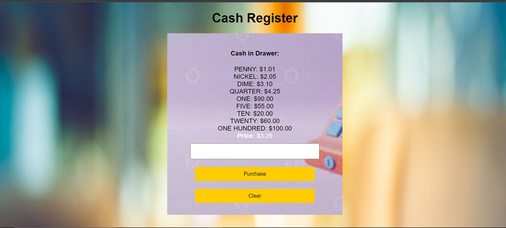

# Cash-Register 🚀

A simple cash register application that calculates the change due when a customer makes a purchase. This project is built with HTML, CSS, and JavaScript.

## Demo 📸

## Features ⭐

- Input the amount of cash given by the customer.
- Calculate and display the change due.
- Display the status of the cash register (OPEN, CLOSED, or INSUFFICIENT_FUNDS).
- Clear the input and reset the display with a clear button.

## Technologies Used 🛠️

- HTML
- CSS
- Javascript

## Getting Started

Prerequisites
To run this project, you need a modern web browser that supports HTML5, CSS3, and JavaScript.

## Installation 💻

1. Clone the repository
   git clone <git@github.com>:faridafaqiri/cash-register.git
2. Navigate to the project directory:
   cd Palindrome-Checker

## Usage

1. Open the index.html file in your web browser.
2. Enter the cash amount in the input field.
3. Click the "Purchase" button to calculate the change due.
4. Click the "Clear" button to reset the input and change display.

## Contributing

Contributions are welcome! Please fork the repository and submit a pull request with your improvements.

## Author 👩‍💻

You can contact me through the following:

- LinkedIn: (<https://www.linkedin.com/in/farida-faqiri-071a31309/>)
- Email: (<farida.faqiri2@gmail.com>)
